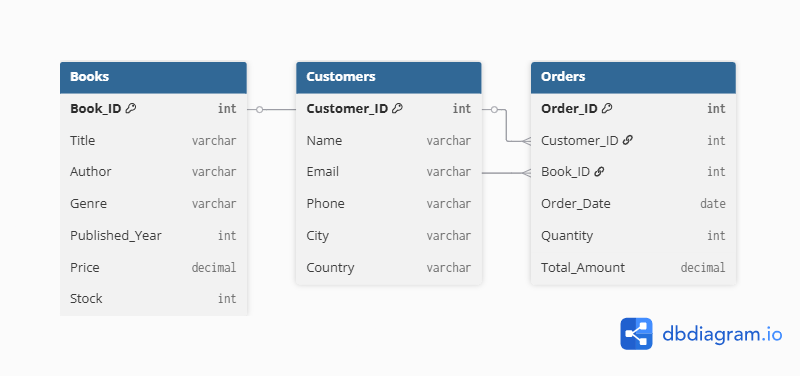

# Online Bookstore Database (PostgreSQL)

###  Overview
This project simulates an **Online Bookstore** database built using **PostgreSQL**.  
It demonstrates database creation, CSV data import, and SQL queries for real-world data analysis.

---

##  Database Design

**Tables:**
- **Books(Book_ID, Title, Author, Genre, Published_Year, Price, Stock)**
- **Customers(Customer_ID, Name, Email, Phone, City, Country)**
- **Orders(Order_ID, Customer_ID, Book_ID, Order_Date, Quantity, Total_Amount)**

**Relationships:**
- Each **Customer** can place multiple **Orders**
- Each **Book** can appear in multiple **Orders**

---

## Database ER Diagram



This ER diagram shows how Books, Customers, and Orders tables are related in the Online Bookstore Database. Each order connects a customer with a book, recording purchase details.
---

### 📂 CSV Data Files
The dataset used in this project can be found in the repository:

- [Books.csv](./Books.csv)
- [Customers.csv](./Customers.csv)
- [Orders.csv](./Orders.csv)

Each file can be directly imported into PostgreSQL using the `COPY` command.


```sql
COPY Books(Book_ID, Title, Author, Genre, Published_Year, Price, Stock)
FROM 'D:/SQL POSTGRE/Books.csv' CSV HEADER;
# Sample Queries
1️. Find all Fiction books
SELECT * FROM Books WHERE Genre = 'Fiction';

2️. Find books published after 1950
SELECT * FROM Books WHERE Published_Year > 1950;

3️. Total stock available
SELECT SUM(Stock) AS Total_Stock FROM Books;

4️. Total revenue generated
SELECT SUM(Total_Amount) AS Total_Revenue FROM Orders;

5️. Top 3 most expensive Fantasy books
SELECT * FROM Books
WHERE Genre='Fantasy'
ORDER BY Price DESC
LIMIT 3;

** Insights Generated
Metric	Example Result
1. Total Revenue	$12,340
2. Most Expensive Book	Harry Potter — $39.99
3. Top Customer Country	Canada
4. Cities with High Spending	Toronto, London
5. Top Genre by Sales	Fantasy
6. Tools Used

PostgreSQL

pgAdmin 4

CSV Files

GitHub

*** Key Learnings

Database design and relationships

SQL Joins, Aggregations, Filtering

Data import using CSV files

Writing analytical queries
